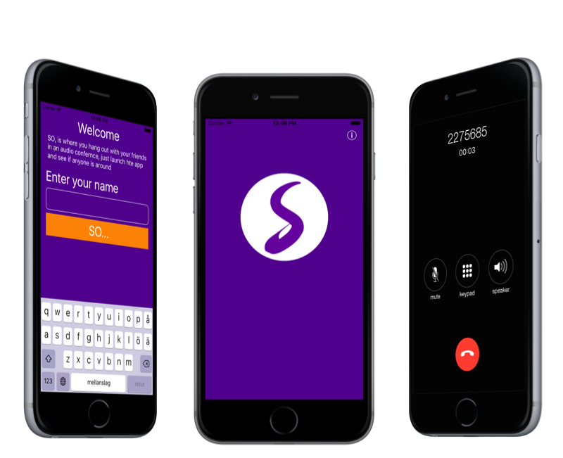
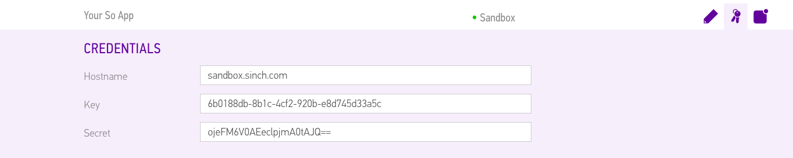
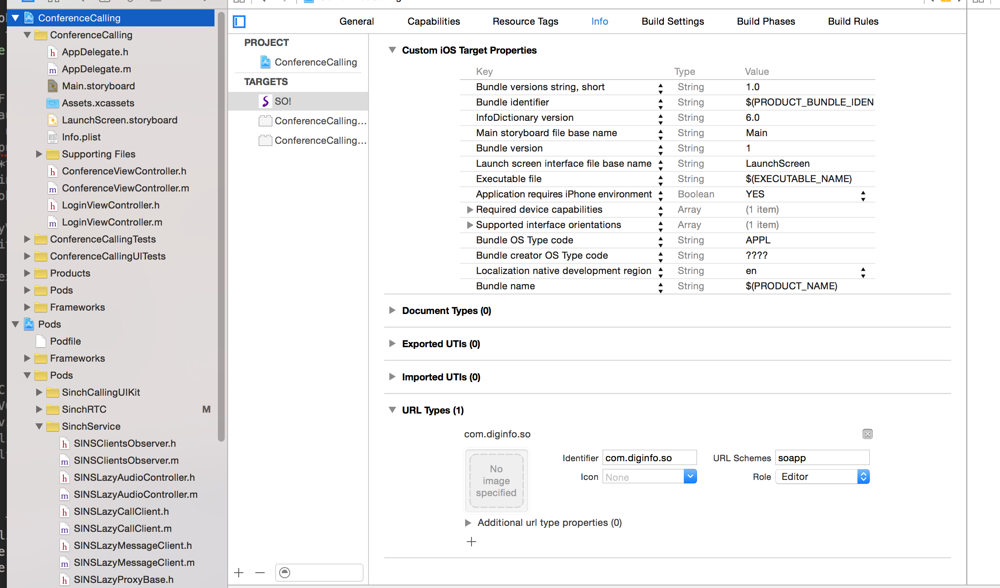

# Building a One-Button App for Conference Calling

Remember [telephone hotlines back in the 80s] (http://guff.com/15-bizarre-1-900-numbers-from-the-80s-and-90s)? I've been thinking about building a one-button app that does something stupid just like [Yo] (https://www.justyo.co/). When we released [Conference Calling] (https://www.sinch.com/products/voice-api/conference-calling/), I thought of the awesome video conferencing sites that are nothing more than a URL, and I wanted to make that kind of app, but for Conference Calling on mobile.

Here comes **So**. An app like Yo, but for hanging out in voice-only group chat rooms. After you download the app, you create a "room" and invite your friends to hangout in it. Whenever you feel like it, open So, click on the button and see who's active at the time.

 

As always the full source code is available on GitHub, [click to download](https://github.com/sinch/ios-conferencecalling-so).

*If you haven’t already, go create [your own Conference Calling system] (https://www.sinch.com/tutorials/build-conference-calling-system-c/) first. 

## Setup 
Login to your Sinch account or go to [sinch.com](https://www.sinch.com/signup) and sign up for free. Then, go to your apps at the dashboard and create a new sandbox app. Take note of your app’s unique key and secret. 



Open up XCode and create a new project using the Single-View Application template. Then set up CocoaPods to work with our app. In this tutorial, we're going to use a small **UIFramework** I made.

Open the directory for the project you just created in Terminal and type:

```
pod init
```

Then open the file named Podfile and add the following line:

```
pod 'SinchCallingUIKit',:git=>'https://github.com/spacedsweden/SinchCallingUIKit.git'
```

After saving the file, install the pod by typing this into the terminal:

```
pod install
```

Now, we’ll see an XCode workspace file with the extension “**.xcworkspace**”. We need to work out of that file instead of our project file from now on. This way, all of our app’s components will work together.

## Story board UI
Create a story board with two view controllers; one conference controller, and one login controller.

**ConferenceController**
Create two buttons in ConferenceController. One is for calling and the other one is an invite button. 

**LoginController**
Add a TextField and a Button to login.

Set the **ConferenceController** scene as the initial ViewController, if it's not already set.

Create a Modal segue to **LoginController** from **ConferenceController**, and call it **login**.

## First use Scenario
Create a new ViewController, name it **ConferenceController**, and assign it to the ConferenceController view in the story board.

The next thing is to check if this is a first use scenario. We're going to store the information, using **NSUserDefault**.

```objectivec
-(void)viewDidAppear:(BOOL)animated
{
    NSUserDefaults* defaults = [NSUserDefaults standardUserDefaults];
    if ([defaults stringForKey:@"userName"] == nil)
    {
        [self performSegueWithIdentifier:@"login" sender:nil];
    }
    else
    {
        [self startClient];
    }
}
```
So, if the user has not entered his name, the login screen will appear.

Now, create a LoginController and assign it to the LoginView in the story board. Create an action for the login button and an outlet for the username text field. 

**LoginViewController.h**

```objectivec
@property (weak, nonatomic) IBOutlet UITextField *userName;
- (IBAction)login:(id)sender;
```

When the user clicks, their username will be set to
**LoginViewController.m**

```objectivec
- (IBAction)login:(id)sender {
    NSUserDefaults* defaults = [NSUserDefaults standardUserDefaults];
    [defaults setObject:self.userName.text forKey:@"userName"];
    [defaults synchronize];
    [self dismissViewControllerAnimated:YES completion:nil];
}
```

Sweet, now we are logged in. As soon as the controller dismisses itself, it'll call the viewDidAppear and `startClient`. Let's implement that in  **ConferenceController.m**:

```objectivec
-(void)startClient {
    NSUserDefaults* defaults = [NSUserDefaults standardUserDefaults];
    [[CallingManager sharedManager] startClientWithKey:yourkey secret:yoursecret userName:[defaults stringForKey:@"userName"] sandbox:NO launchOptions:nil];
}
```

This simply enables a call to the shared manager, and starts the client with the username you saved to NSUserDefaults.

Now, it's time to implement the conference calling feature! Create IBActions to the Call and Invite buttons in your **Main.storyboard**. Since this almost a one-button app, let's hide the Invite People button in the view.

```objectivec
- (void)viewDidLoad {
    [super viewDidLoad];
    if ([[NSUserDefaults standardUserDefaults] stringForKey:@"conferenceId"] == nil){
        self.invite.hidden = YES;
    }
    // Do any additional setup after loading the view.
}
```

## Call button
Making a call is essentially a one liner, but in this method, we're going to take care of a bunch of stuff since it's a one-button app!

To create a Conference ID, store it to defaults, etc., add the following in your action for the call: 

```objectivec
- (IBAction)CreateConference:(id)sender {
  //First time use
  if ([defaults stringForKey:@"conferenceId"] == nil)
    {
    ///create a random number that will be the conferenceId
        NSString* conferenceId = [NSString stringWithFormat:@"%d", arc4random_uniform(9000000) + 1000000];
        ;
        //set the share URL that will be sent to friends (make sure you create your own prefix, more about that later in the tutorial)
        [defaults setObject:[NSString stringWithFormat:@"%@%@", @"soapp://", conferenceId] forKey:@"conferenceURL"];
        [defaults setObject:conferenceId forKey:@"conferenceId"];
        [defaults synchronize];
        //invite your friends and make the invite more people visible
        [self inviteFriends];
        self.invite.hidden = NO;
    }
    else
    {//Not first use, just connect to the conference
        [[CallingManager sharedManager] callConference:[defaults stringForKey:@"conferenceId"]];
    }
}
```

## Invite friends
As you probably know, iOS has this wonderful share functionality for apps like the one we're creating right now. Users can super easy be a part of the menu and share the app to any social network that's available on their phone. Read more about the UIActivityViewController [here](http://www.codingexplorer.com/add-sharing-to-your-app-via-uiactivityviewcontroller/). 

```objectivec
-(void)inviteFriends{
    NSUserDefaults* defaults = [NSUserDefaults standardUserDefaults];
    NSString* url = [defaults stringForKey:@"conferenceURL"];
    NSURL *appurl = [NSURL URLWithString:url];
    NSString *textToShare = [NSString stringWithFormat:@"Hey, So... whats up, join %@ here\n/%@", appurl, [defaults stringForKey:@"userName"]];
    NSArray *objectsToShare = @[textToShare];
    
    UIActivityViewController *activityVC = [[UIActivityViewController alloc] initWithActivityItems:objectsToShare applicationActivities:nil];
    
    NSArray *excludeActivities = @[UIActivityTypeAirDrop,
                                   UIActivityTypePrint,
                                   UIActivityTypeAssignToContact,
                                   UIActivityTypeSaveToCameraRoll,
                                   UIActivityTypeAddToReadingList,
                                   UIActivityTypePostToFlickr,
                                   UIActivityTypePostToVimeo];
    activityVC.excludedActivityTypes = excludeActivities;
    [activityVC setCompletionWithItemsHandler:^(NSString *activityType, BOOL completed, NSArray *returnedItems, NSError *activityError) {
        [[CallingManager sharedManager] callConference:[defaults stringForKey:@"conferenceId"]];
    }];   [self presentViewController:activityVC animated:YES completion:nil];
}
```

This snippet of code creates a special link, and composes a personal message that can be sent to anyone. The link is something your can register in your **info.p** list - whenever someone clicks the link they'll either be sent directly to your app, or to the App Store for downloading it. When they return from sharing, we're connecting the user to the conference. 

## Listen to URLTypes
Open the info tab of your target to edit the p list and add an URL type to match the one you choose. In my case it's `soap://`. The iPhone will search for an app that listens, whenever someone clicks on a link with `soap://`.




## Reacting to a clicked URLTypes
Now that we have a URL type defined, we can react to a clicked link instead of just launching the app **AppDelegate.m**. Add:

```objectivc
- (BOOL)application:(UIApplication *)application handleOpenURL:(NSURL *)url {
    NSString *text = [[url host] stringByReplacingPercentEscapesUsingEncoding:NSUTF8StringEncoding];
    [[CallingManager sharedManager] callConference:text];
    return YES;
}
```

Take a look at what the host passed to the app, and connect to the conference immediately. 

That's it. Hanging out with friends and family is now literally one button press away! If you want to check out Christian's finished version first, you can [download the app](https://itunes.apple.com/us/app/so!/id1044103096?mt=8) on iTunes.


